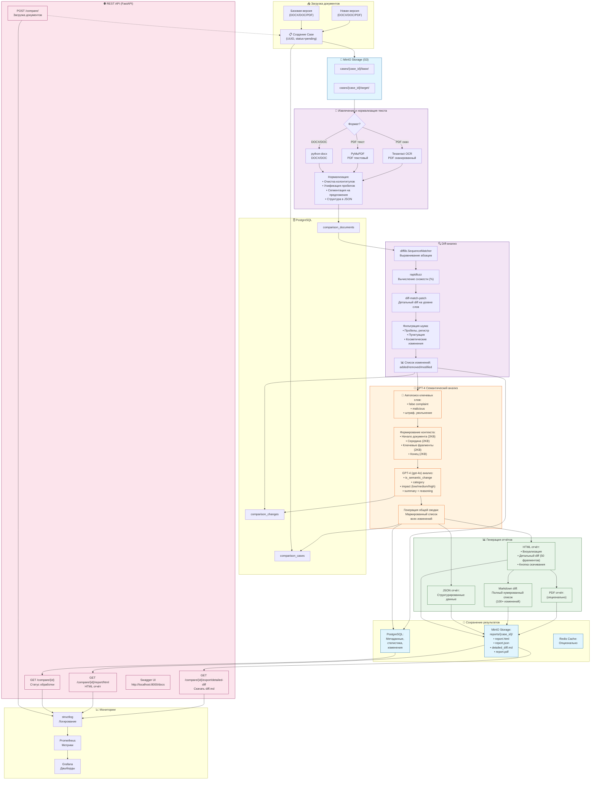

# Архитектура DocCompare

## Диаграмма потока обработки



## Технологический стек

### Backend
- **Python 3.9+**
- **FastAPI** - REST API framework
- **SQLAlchemy** - ORM с async поддержкой
- **Pydantic** - валидация данных

### Обработка документов
- **python-docx** - извлечение из DOCX
- **PyMuPDF (fitz)** - извлечение из PDF
- **Tesseract OCR** - распознавание сканов
- **pdf2image** - конвертация PDF в изображения

### Diff-анализ
- **difflib** (встроенная) - основной diff алгоритм
- **diff-match-patch** - детальный посимвольный diff
- **rapidfuzz** - вычисление схожести текстов (Levenshtein)

### LLM и AI
- **OpenAI GPT-4 (gpt-4o)** - семантический анализ
- **tiktoken** - подсчёт токенов
- **Автопоиск ключевых слов** - для полного анализа

### Инфраструктура
- **PostgreSQL 16** - хранение метаданных и результатов
- **Redis 7** - кэширование (опционально)
- **MinIO** - S3-совместимое хранилище файлов
- **Docker Compose** - оркестрация сервисов

### Отчёты
- **Jinja2** - шаблонизация HTML
- **WeasyPrint** - генерация PDF (опционально)
- **Markdown** - детальный diff-список

### Мониторинг
- **Prometheus** - сбор метрик
- **Grafana** - визуализация
- **structlog** - структурированное логирование
- **Sentry** - отслеживание ошибок (опционально)

## Структура хранения

### MinIO (S3-хранилище)

```
doccompare/
├── cases/
│   └── {case_id}/
│       ├── base/
│       │   └── document_v1.docx
│       └── target/
│           └── document_v2.docx
│
└── reports/
    └── {case_id}/
        ├── report.html          # HTML отчёт с визуализацией
        ├── report.json          # JSON данные
        ├── report.pdf           # PDF отчёт
        └── detailed_diff.md     # Детальный diff (при скачивании)
```

### PostgreSQL

```sql
-- Кейс сравнения
comparison_cases
  - id (UUID)
  - status (pending/extracting/diffing/analyzing/generating/completed/failed)
  - total_changes, semantic_changes_count, technical_changes_count
  - overall_impact, summary
  - html_report_path, json_report_path, pdf_report_path
  - processing_time

-- Документы
comparison_documents
  - id, case_id
  - document_type (base/target)
  - original_filename, file_format, file_size
  - extracted_text, normalized_text, structure
  - is_scanned, ocr_confidence

-- Изменения
comparison_changes
  - id, case_id
  - position, change_type (added/removed/modified)
  - old_text, new_text, context_before, context_after
  - is_semantic_change, category, impact
  - llm_summary, llm_reasoning
  - similarity_score
```

## Pipeline обработки

### Этап 1: Загрузка (Ingestion)
1. Клиент загружает два файла через API
2. Создаётся Case с уникальным UUID
3. Файлы сохраняются в MinIO: `cases/{case_id}/base/` и `target/`
4. Создаются записи в БД

### Этап 2: Извлечение текста (Extraction)
1. Определение формата файла
2. Извлечение:
   - DOCX → python-docx
   - PDF текстовый → PyMuPDF
   - PDF скан → Tesseract OCR + pdf2image
3. Нормализация текста
4. Сегментация на предложения
5. Сохранение в БД

### Этап 3: Diff-анализ (Technical Diff)
1. Выравнивание абзацев (difflib.SequenceMatcher)
2. Вычисление операций: equal/delete/insert/replace
3. Оценка схожести (rapidfuzz.fuzz.ratio)
4. Детальный diff внутри абзацев (diff-match-patch)
5. Фильтрация шума (пробелы, регистр, пунктуация)
6. Формирование списка изменений
7. Сохранение в БД

### Этап 4: Семантический анализ (LLM Layer)
1. **Автопоиск ключевых слов** в новом тексте:
   - "false complaint", "malicious complaint"
   - Штрафы, наказания, увольнения
2. Формирование контекста для GPT-4:
   - Начало документа (2KB)
   - Середина (2KB)
   - Ключевые фрагменты (2KB) ← НОВОЕ!
   - Конец (2KB)
3. Анализ каждого изменения через GPT-4:
   - Семантическое или техническое?
   - Категория (dates/financial/obligations/conditions/parties)
   - Влияние (low/medium/high)
   - Описание на русском языке
4. Генерация общей сводки (маркированный список)
5. Сохранение результатов в БД

### Этап 5: Генерация отчётов (Reporting)
1. **HTML отчёт:**
   - Статистика и сводка GPT-4
   - Сравнение текстов (было/стало)
   - Детальный diff в HTML (первые 50 фрагментов)
   - Кнопка скачивания полного diff ← НОВОЕ!
   
2. **JSON отчёт:**
   - Полные структурированные данные
   
3. **Markdown diff** (при скачивании):
   - Нумерованный список всех изменений
   - Маркеры: ➕ добавлено / ➖ удалено / ✏️ изменено
   - Фрагменты текста
   
4. **PDF отчёт** (опционально):
   - Конвертация HTML → PDF через WeasyPrint

5. Сохранение в MinIO: `reports/{case_id}/`

### Этап 6: API и доступ (Access)
1. REST API endpoints:
   - `POST /api/v1/compare/` - загрузка
   - `GET /api/v1/compare/{id}` - статус
   - `GET /api/v1/compare/{id}/report/html` - HTML отчёт
   - `GET /api/v1/compare/{id}/export/detailed-diff` - скачать diff ← НОВОЕ!
   
2. Swagger UI для интерактивного тестирования

3. Автодокументация OpenAPI

## Ключевые улучшения реализации

### ✅ Реализовано дополнительно

1. **Автопоиск ключевых фрагментов**
   - Автоматическое обнаружение важных изменений
   - Добавление в контекст GPT-4
   
2. **Детальный diff в HTML**
   - Первые 20-50 изменений показаны прямо в отчёте
   - Нумерованный список с цветовой кодировкой
   
3. **Кнопка скачивания в браузере**
   - Красивый UI-блок в HTML отчёте
   - Прямое скачивание Markdown diff
   
4. **Организация по case_id**
   - Все файлы кейса в одной папке
   - Удобная структура хранения
   
5. **Улучшенные промпты GPT-4**
   - Детальные инструкции
   - Фокус на удаления и замены
   - Маркированный список в сводке

6. **Скрипты для работы**
   - `compare_my_docs.py` - сравнение документов
   - `show_diff_list.py` - детальный diff список
   - `get_changes_list.py` - краткий список

## Мониторинг и метрики

- **Prometheus metrics** - время обработки, количество кейсов, ошибки
- **Grafana dashboards** - визуализация метрик
- **structlog** - структурированные логи в JSON
- **Health checks** - `/health` endpoint

## Производительность

- Обработка документа 60KB: **14-17 секунд**
- Parallel batch processing: до 5 изменений одновременно
- Async I/O: FastAPI + asyncpg + aiohttp
- Кэширование: Redis (опционально)

## Безопасность

- Валидация файлов (размер, формат)
- Изоляция кейсов по UUID
- Очистка временных файлов
- CORS middleware для API
- Опциональная аутентификация

---

**Создано:** 22 октября 2025  
**Репозиторий:** https://github.com/travinov/DocCompare

